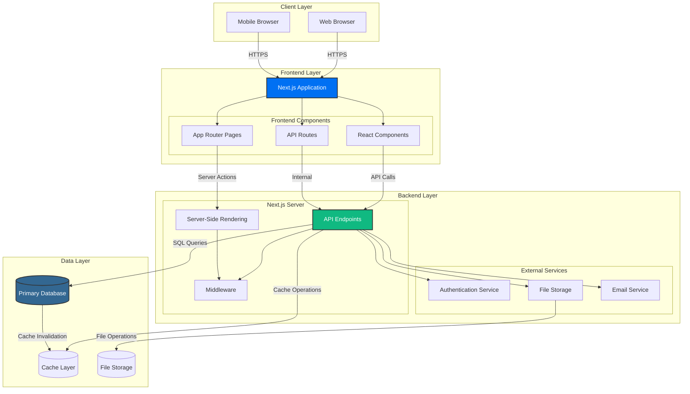

# Home Swap Application

This is a [Next.js](https://nextjs.org) project for a home item swapping platform, bootstrapped with [`create-next-app`](https://nextjs.org/docs/app/api-reference/cli/create-next-app).

## Getting Started

First, run the development server:

```bash
npm run dev
# or
yarn dev
# or
pnpm dev
# or
bun dev
```

Open [http://localhost:3000](http://localhost:3000) with your browser to see the result.

You can start editing the page by modifying `app/page.tsx`. The page auto-updates as you edit the file.

This project uses [`next/font`](https://nextjs.org/docs/app/building-your-application/optimizing/fonts) to automatically optimize and load [Geist](https://vercel.com/font), a new font family for Vercel.

### Seed a local database

The project uses a MongoDB database that is seeded with the 4 main objects types:

- Users
- Items
- Swaps
- Logs

Chats may be added later if there is time.

To seed the database:

```bash
npm run seed:db
```

## Learn More

To learn more about Next.js, take a look at the following resources:

- [Next.js Documentation](https://nextjs.org/docs) - learn about Next.js features and API.
- [Learn Next.js](https://nextjs.org/learn) - an interactive Next.js tutorial.

You can check out [the Next.js GitHub repository](https://github.com/vercel/next.js) - your feedback and contributions are welcome!

## Deploy on Vercel

The easiest way to deploy your Next.js app is to use the [Vercel Platform](https://vercel.com/new?utm_medium=default-template&filter=next.js&utm_source=create-next-app&utm_campaign=create-next-app-readme) from the creators of Next.js.

Check out our [Next.js deployment documentation](https://nextjs.org/docs/app/building-your-application/deploying) for more details.

## System Architecture

The Home Swap application follows a modern web architecture with clear separation between frontend, backend, and data layers:



### Key Components

- **Frontend**: Next.js 16.1.1 with React 19.2.3, TypeScript, and Tailwind CSS
- **Backend**: Next.js API routes with server-side rendering and middleware
- **Database**: Relational database for user accounts, items, and swap data
- **Cache**: Redis for session management and performance optimization
- **Storage**: Cloud storage for item images and user avatars

## Documentation

- [System Architecture](./docs/SYSTEM_ARCHITECTURE.md) - Comprehensive system architecture diagrams and technical details
- [Team Onboarding](./docs/TEAM_ONBOARDING.md) - Developer onboarding guide
- [Coding Standards](./CODING_STANDARDS.md) - Project coding standards and best practices
