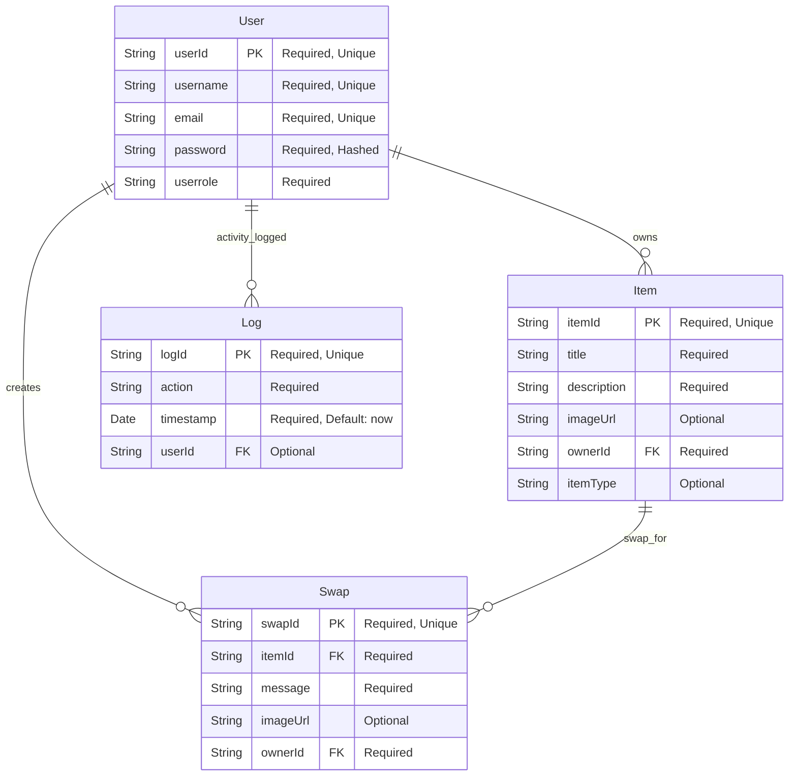

# Database Schema Diagram

This document provides a visual representation of the Home Swap Platform database schema, showing the four main collections and their relationships.

## Entity Relationship Diagram

## Collection Descriptions

### Users Collection

The **Users** collection stores user account information and authentication data.

**Fields:**

- `userId`: Unique identifier for each user (String, Primary Key)
- `username`: Display name for the user (String, Required, Unique)
- `email`: User's email address (String, Required, Unique)
- `password`: Hashed password using bcrypt (String, Required)
- `userrole`: User role/type in the system (String, Required)

**Security Features:**

- Passwords are automatically hashed before saving using bcrypt
- Pre-save and pre-insertMany middleware for password hashing
- comparePassword method for authentication

### Items Collection

The **Items** collection stores information about items available for swapping.

**Fields:**

- `itemId`: Unique identifier for each item (String, Primary Key)
- `title`: Name/title of the item (String, Required)
- `description`: Detailed description of the item (String, Required)
- `imageUrl`: URL to item image (String, Optional)
- `ownerId`: Reference to the user who owns the item (String, Foreign Key)
- `itemType`: Category/type of item (String, Optional)

### Swaps Collection

The **Swaps** collection represents swap requests/offers between users.

**Fields:**

- `swapId`: Unique identifier for each swap (String, Primary Key)
- `itemId`: Reference to the item being requested (String, Foreign Key)
- `message`: Message from user making the swap offer (String, Required)
- `imageUrl`: URL to image of item being offered (String, Optional)
- `ownerId`: Reference to user making the swap offer (String, Foreign Key)

### Logs Collection

The **Logs** collection tracks system activities and user actions for auditing.

**Fields:**

- `logId`: Unique identifier for each log entry (String, Primary Key)
- `action`: Type of action performed (String, Required)
- `timestamp`: When the action occurred (Date, Required, Auto-generated)
- `userId`: Reference to user who performed the action (String, Foreign Key, Optional)

## Relationships

1. **User → Items**: One-to-Many
   - Each user can own multiple items
   - Each item belongs to exactly one user

2. **User → Swaps**: One-to-Many
   - Each user can create multiple swap requests
   - Each swap request is created by exactly one user

3. **Item → Swaps**: One-to-Many
   - Each item can have multiple swap requests
   - Each swap request is for exactly one item

4. **User → Logs**: One-to-Many
   - Each user can have multiple log entries
   - Each log entry may be associated with one user (optional for system logs)

## Data Types & Constraints

- **String**: Text data with MongoDB ObjectId support
- **Date**: ISO date format with automatic timestamp generation
- **Required**: Field must be present when creating documents
- **Unique**: Field values must be unique across the collection
- **Optional**: Field may be omitted during document creation

## Further Work – Indexing

For optimal query performance, creates indexes on:

- `User.email` - For login/authentication queries
- `User.username` - For user search and lookup
- `Item.ownerId` - For fetching user's items
- `Swap.itemId` - For fetching swaps for specific items
- `Swap.ownerId` - For fetching user's swap requests
- `Log.userId` - For user activity tracking
- `Log.timestamp` - For chronological log queries

## Sample Data Flow

1. **User Registration**: New user document created in Users collection
2. **Item Listing**: User creates item document in Items collection with ownerId reference
3. **Swap Request**: Another user creates swap document in Swaps collection referencing itemId
4. **Activity Logging**: All actions are logged in Logs collection with appropriate userId references
