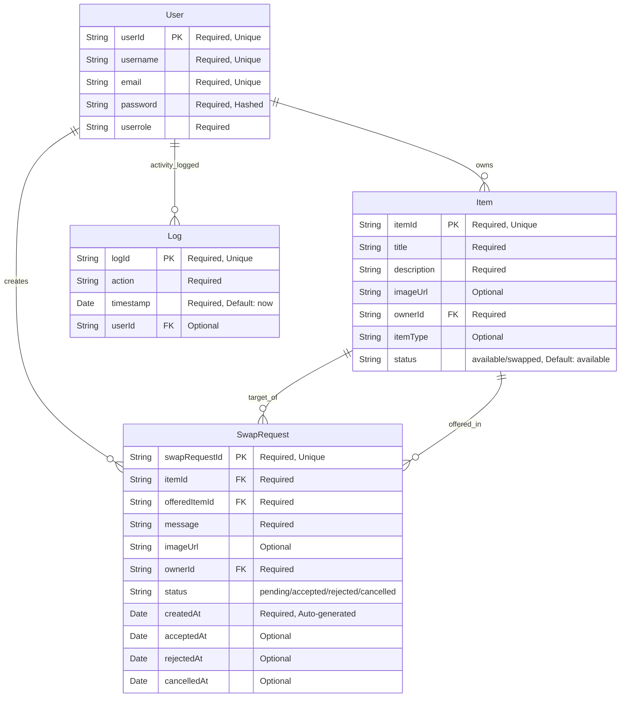

# Database Schema Diagram

This document provides a visual representation of the Home Swap Platform database schema, showing the four main collections and their relationships.

## Entity Relationship Diagram

## Collection Descriptions

### Users Collection

The **Users** collection stores user account information and authentication data.

**Fields:**

- `userId`: Unique identifier for each user (String, Primary Key)
- `username`: Display name for the user (String, Required, Unique)
- `email`: User's email address (String, Required, Unique)
- `password`: Hashed password using bcrypt (String, Required)
- `userrole`: User role/type in the system (String, Required)

**Security Features:**

- Passwords are automatically hashed before saving using bcrypt
- Pre-save and pre-insertMany middleware for password hashing
- comparePassword method for authentication

### Items Collection

The **Items** collection stores information about items available for swapping.

**Fields:**

- `itemId`: Unique identifier for each item (String, Primary Key)
- `title`: Name/title of the item (String, Required)
- `description`: Detailed description of the item (String, Required)
- `imageUrl`: URL to item image (String, Optional)
- `ownerId`: Reference to the user who owns the item (String, Foreign Key)
- `itemType`: Category/type of item (String, Optional)
- `status`: Current availability status - 'available' (default) or 'swapped' (String, Required)

**Status Field Behavior:**

- Items start as 'available' when created
- When a swap request is accepted, both items are automatically marked as 'swapped'
- Swapped items are excluded from search results by default
- Users can optionally include swapped items in search results

### SwapRequests Collection

The **SwapRequests** collection represents swap requests/offers between users for specific items.

**Fields:**

- `swapRequestId`: Unique identifier for each swap request (String, Primary Key)
- `itemId`: Reference to the item being requested (String, Foreign Key)
- `offeredItemId`: Reference to the item being offered in exchange (String, Foreign Key)
- `message`: Message from user making the swap offer (String, Required)
- `imageUrl`: URL to image of item being offered (String, Optional)
- `ownerId`: Reference to user making the swap offer (String, Foreign Key)
- `status`: Current status of the request - pending, accepted, rejected, or cancelled (String, Required)
- `createdAt`: Timestamp when request was created (Date, Auto-generated)
- `acceptedAt`: Timestamp when request was accepted (Date, Optional)
- `rejectedAt`: Timestamp when request was rejected (Date, Optional)
- `cancelledAt`: Timestamp when request was cancelled (Date, Optional)

### Logs Collection

The **Logs** collection tracks system activities and user actions for auditing.

**Fields:**

- `logId`: Unique identifier for each log entry (String, Primary Key)
- `action`: Type of action performed (String, Required)
- `timestamp`: When the action occurred (Date, Required, Auto-generated)
- `userId`: Reference to user who performed the action (String, Foreign Key, Optional)

## Relationships

1. **User → Items**: One-to-Many
   - Each user can own multiple items
   - Each item belongs to exactly one user

2. **User → SwapRequests**: One-to-Many
   - Each user can create multiple swap requests
   - Each swap request is created by exactly one user

3. **Item → SwapRequests**: One-to-Many (Two relationships)
   - Each item can be the target of multiple swap requests
   - Each item can be offered in multiple swap requests
   - Each swap request targets exactly one item and offers exactly one item

4. **User → Logs**: One-to-Many
   - Each user can have multiple log entries
   - Each log entry may be associated with one user (optional for system logs)

## Data Types & Constraints

- **String**: Text data with MongoDB ObjectId support
- **Date**: ISO date format with automatic timestamp generation
- **Required**: Field must be present when creating documents
- **Unique**: Field values must be unique across the collection
- **Optional**: Field may be omitted during document creation

## Database Indexes

For optimal query performance, the following indexes have been implemented:

### Users Collection Indexes

- **Primary Indexes** (Unique):
  - `userId` - Primary key (unique)
  - `username` - User lookup (unique)
  - `email` - Authentication (unique)
  
- **Performance Indexes**:
  - `userrole` - Filter by user role/type
  - `createdAt` (descending) - Chronological user queries
  - `userrole + createdAt` (compound) - Admin dashboard queries

### Items Collection Indexes

- **Primary Indexes** (Unique):
  - `itemId` - Primary key (unique)
  
- **Individual Field Indexes**:
  - `ownerId` - Fetch user's items
  - `itemType` - Category-based filtering
  - `hasImage` - Filter items with/without images
  - `status` - Filter by availability status
  
- **Compound Indexes**:
  - `ownerId + itemType` - Owner's items by category
  - `ownerId + hasImage` - Owner's items with/without images
  - `status + itemType` - Available items by category
  - `status + createdAt` - Available items chronologically

### SwapRequests Collection Indexes

- **Primary Indexes** (Unique):
  - `swapRequestId` - Primary key (unique)
  
- **Compound Indexes**:
  - `itemId + status` - Filter requests by item and status
  - `ownerId + status` - Filter user's requests by status
  - `itemId + createdAt` - Chronological requests on items

### Logs Collection Indexes

- **Primary Indexes** (Unique):
  - `logId` - Primary key (unique)
  
- **Individual Field Indexes**:
  - `timestamp` (descending) - Chronological log retrieval
  - `action` - Filter by action type
  - `userId` - User activity logs
  
- **Compound Indexes**:
  - `userId + timestamp` - User's chronological activity
  - `action + timestamp` - Action-based chronological queries

## Index Benefits

These indexes provide significant performance improvements for:
- ✅ User dashboard loading (own items, swap requests)
- ✅ Search and filtering operations  
- ✅ Admin queries and reporting
- ✅ Activity logging and monitoring
- ✅ Swap request management
- ✅ Authentication and user lookup
- ✅ Category-based item browsing

## Sample Data Flow

1. **User Registration**: New user document created in Users collection
2. **Item Listing**: User creates item document in Items collection with ownerId reference and status 'available'
3. **Swap Request**: Another user creates swap request document in SwapRequests collection referencing both target itemId and their own offered itemId
4. **Request Processing**: Item owner can accept/reject the swap request, updating the status field
   - **If Accepted**: Both items' status is updated to 'swapped', making them unavailable for new requests
   - **If Rejected**: Items remain 'available' for other swap opportunities
5. **Search Filtering**: Search results exclude 'swapped' items by default, with option to include them
6. **Activity Logging**: All actions are logged in Logs collection with appropriate userId references
