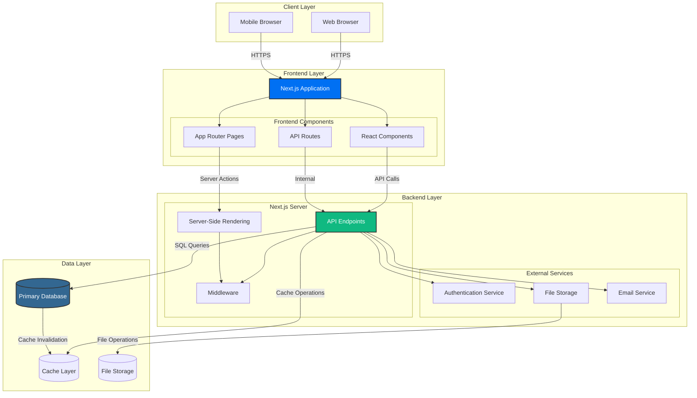
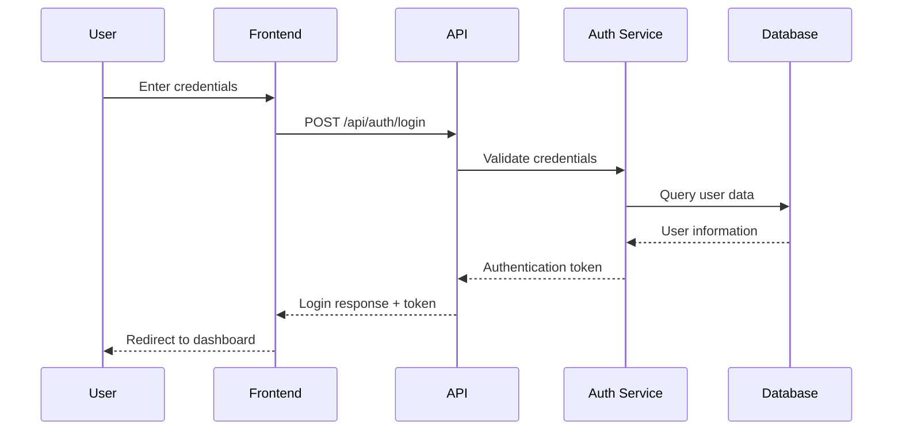
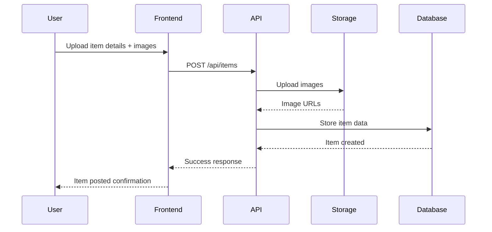
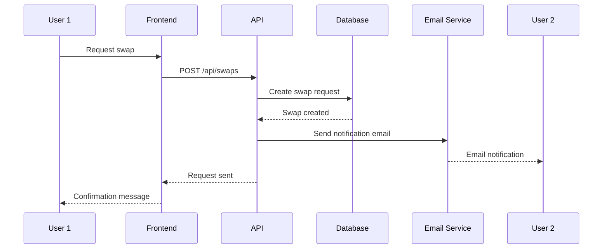
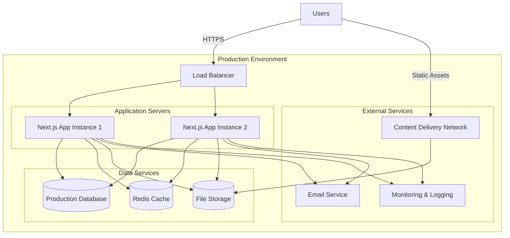

# Home Swap System Architecture

## Overview

This document provides a comprehensive system architecture diagram for the Home Swap application, showing how the frontend, backend, and database components interact to enable users to swap items with each other.

## System Architecture Diagram

## Component Details

### Frontend Layer (Next.js 16.1.1)

- **React Components**: User interface components built with React 19.2.3
- **App Router Pages**: Next.js App Router for routing and page management
- **API Routes**: Server-side API endpoints within the Next.js application
- **Styling**: Tailwind CSS for responsive design

### Backend Layer

- **Server-Side Rendering**: Next.js SSR for improved performance and SEO
- **API Endpoints**: RESTful APIs for data operations
- **Middleware**: Authentication, validation, and request processing
- **External Services**: Third-party integrations for auth, storage, and notifications

### Data Layer

- **Primary Database**: Stores user accounts, items, swap requests, and messages
- **Cache Layer**: Redis or similar for session management and performance
- **File Storage**: Cloud storage for item images and user avatars

## Data Flow

### User Registration/Login Flow

### Item Posting Flow

### Swap Request Flow

## Technology Stack

### Frontend

- **Framework**: Next.js 16.1.1 with App Router
- **UI Library**: React 19.2.3
- **Styling**: Tailwind CSS 4.0
- **Language**: TypeScript 5.x
- **Build Tools**: ESLint, Prettier, Husky

### Backend

- **Runtime**: Node.js (via Next.js)
- **API**: Next.js API Routes
- **Authentication**: JWT or session-based
- **File Upload**: Multipart form handling

### Database & Storage

- **Database**: PostgreSQL or MongoDB (to be determined)
- **Cache**: Redis (recommended)
- **File Storage**: AWS S3, Cloudinary, or similar
- **CDN**: For static asset delivery

## Security Considerations

- **Authentication**: Secure user authentication with JWT tokens
- **Authorization**: Role-based access control
- **Data Validation**: Input sanitization and validation
- **File Upload**: Secure file handling with type and size restrictions
- **HTTPS**: All communications encrypted
- **CORS**: Proper cross-origin resource sharing configuration

## Scalability & Performance

- **Caching**: Redis for session and data caching
- **CDN**: Static asset delivery optimization
- **Database Indexing**: Optimized queries for item search and user lookup
- **Image Optimization**: Next.js built-in image optimization
- **Code Splitting**: Automatic code splitting with Next.js

## Deployment Architecture

## Future Enhancements

- **Microservices**: Potential migration to microservices architecture
- **Real-time Features**: WebSocket integration for live messaging
- **Mobile Apps**: Native mobile applications
- **AI/ML**: Recommendation engine for item matching
- **Analytics**: User behavior tracking and analytics dashboard

---

_This architecture diagram serves as the foundation for the Home Swap system development and can be updated as requirements evolve._
