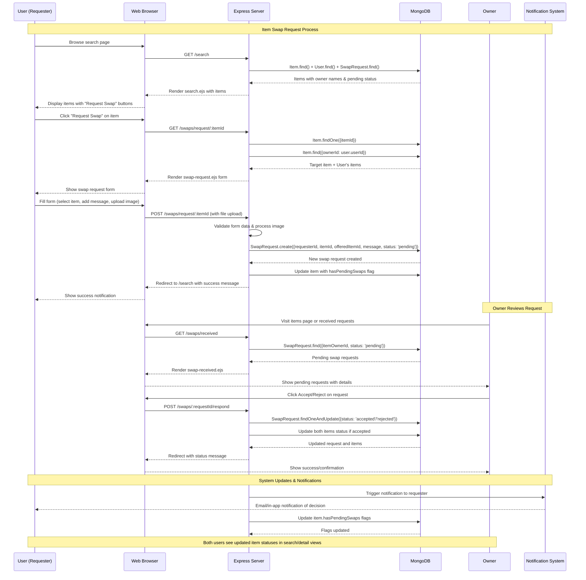
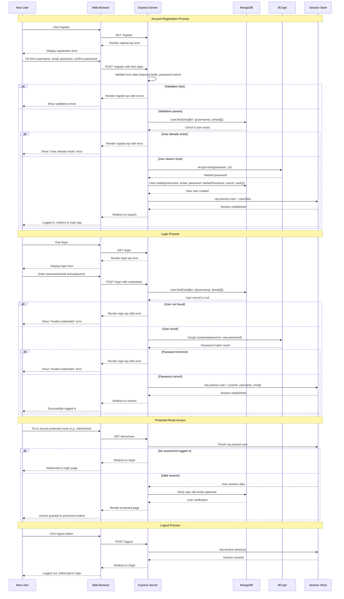

# HomeSwap Platform - Use Case Diagrams

## 1. Swap Request Feature Flow

## 2. User Authentication & Account Creation Flow

## Key Components Explained

### Swap Feature Components:

- **Express Routes**: `/swaps/request/:itemId`, `/swaps/received`, `/swaps/:requestId/respond`
- **Models**: `SwapRequest`, `Item`, `User`
- **Views**: `search.ejs`, `swap-request.ejs`, `swap-received.ejs`
- **File Upload**: Multer middleware for swap offer images
- **Status Management**: Pending → Accepted/Rejected workflow

### Authentication Components:

- **Express Routes**: `/register`, `/login`, `/logout`
- **Middleware**: Session validation on protected routes
- **Security**: BCrypt password hashing
- **Session Management**: Express-session with MongoDB store
- **Models**: `User` model with unique constraints
- **Validation**: Form validation and duplicate user checks

### Database Schema Integration:

- **Users**: `userId` (UUID), `username`, `email`, `password` (hashed)
- **Items**: `itemId`, `ownerId`, `status`, `hasPendingSwaps`
- **SwapRequests**: `requesterId`, `itemId`, `offeredItemId`, `status`, `createdAt`
- **Indexes**: Optimized queries for user lookups and swap status checks
