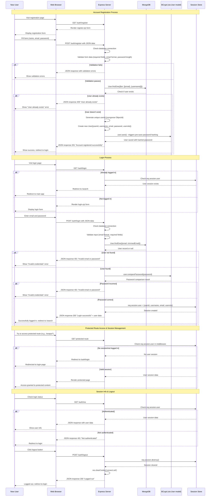
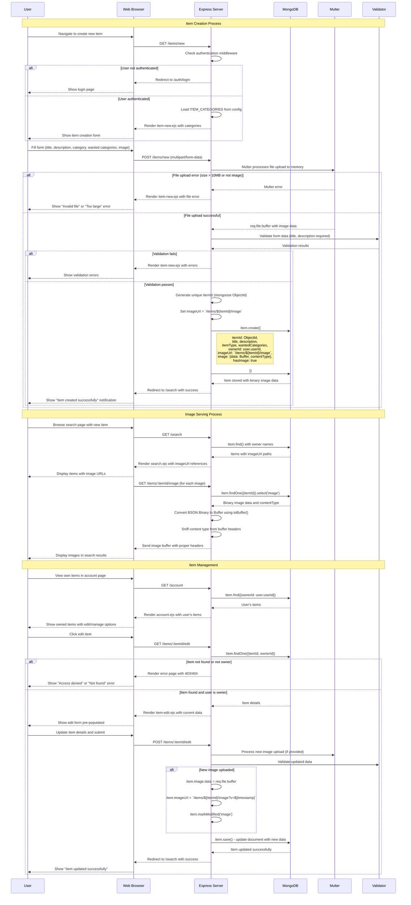
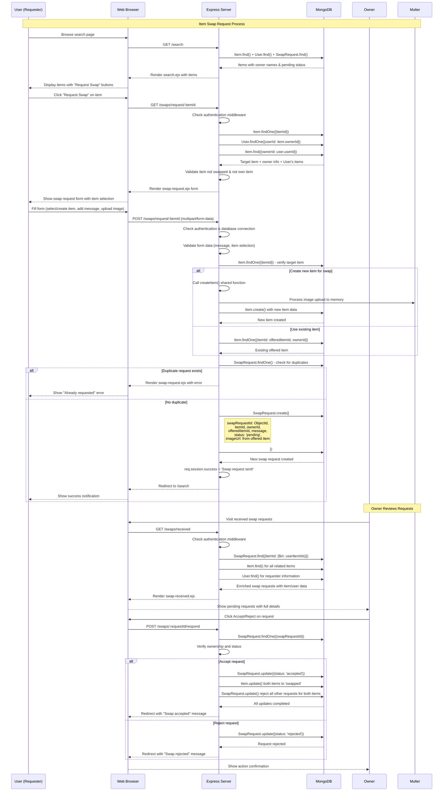

# HomeSwap Platform - Use Case Diagrams

## 1. User Authentication & Account Creation Flow

## 2. Item Creation Feature Flow

## 3. Swap Request Feature Flow

## Key Components Explained

### Authentication Components:

- **Express Routes**: `/register`, `/login`, `/logout`
- **Middleware**: Session validation on protected routes
- **Security**: BCrypt password hashing
- **Session Management**: Express-session with MongoDB store
- **Models**: `User` model with unique constraints
- **Validation**: Form validation and duplicate user checks

### Item Creation Components:

- **Express Routes**: `/items/new`, `/items/:itemId/edit`, `/items/:itemId/image`
- **Models**: `Item` with embedded image binary data
- **Views**: `item-new.ejs`, `item-edit.ejs`, `account.ejs`
- **File Upload**: Multer with memoryStorage() for 10MB limit, image-only filter
- **Image Storage**: Binary data stored in MongoDB `image.data` field as Buffer
- **Image Serving**: Dynamic route `/items/:itemId/image` serves from database
- **Content Type Detection**: Sniffs image headers for proper MIME types
- **Validation**: Form validation, required fields, category selection
- **ObjectId Generation**: Unique item identifiers using mongoose ObjectId
- **Authentication**: Protected routes requiring login session
- **Cache Control**: No-cache headers for immediate image updates

### Swap Feature Components:

- **Express Routes**: `/swaps/request/:itemId`, `/swaps/received`, `/swaps/:requestId/respond`
- **Models**: `SwapRequest`, `Item`, `User`
- **Views**: `search.ejs`, `swap-request.ejs`, `swap-received.ejs`
- **File Upload**: Multer middleware for swap offer images
- **Status Management**: Pending → Accepted/Rejected workflow

### Database Schema Integration:

- **Users**: `userId` (UUID), `username`, `email`, `password` (hashed)
- **Items**: `itemId`, `ownerId`, `status`, `hasPendingSwaps`
- **SwapRequests**: `requesterId`, `itemId`, `offeredItemId`, `status`, `createdAt`
- **Indexes**: Optimized queries for user lookups and swap status checks
